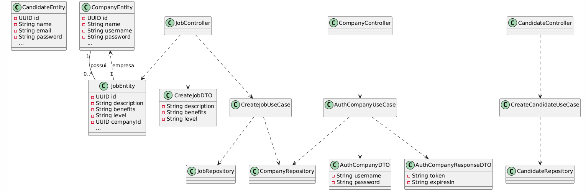

# Gestão de Vagas

Sistema de gestão de vagas de emprego desenvolvido em Java com Spring Boot, seguindo boas práticas de arquitetura, segurança e organização de código.

---

## 📋 Sumário

- [Sobre o Projeto](#sobre-o-projeto)
- [Tecnologias Utilizadas](#tecnologias-utilizadas)
- [Como Rodar o Projeto](#como-rodar-o-projeto)
- [Boas Práticas Adotadas](#boas-práticas-adotadas)
- [Estrutura do Projeto](#estrutura-do-projeto)
- [UML do Projeto](#uml-do-projeto)
- [Contribuição](#contribuição)
- [Licença](#licença)

---

## Sobre o Projeto

O **Gestão de Vagas** é uma API RESTful para cadastro, autenticação e gerenciamento de candidatos, empresas e vagas de emprego. O projeto foi desenvolvido com foco em segurança, separação de responsabilidades e escalabilidade.

---

## Tecnologias Utilizadas

- Java 17+
- Spring Boot
- Spring Security
- JWT (JSON Web Token)
- Lombok
- JPA/Hibernate
- Banco de Dados relacional (ex: PostgreSQL, H2)
- Maven

---

## Como Rodar o Projeto

1. **Clone o repositório:**
   ```bash
   git clone https://github.com/seu-usuario/gestao_vagas.git
   cd gestao_vagas
   ```

2. **Configure o banco de dados em `src/main/resources/application.properties`.**

3. **Instale as dependências e rode a aplicação:**
   ```bash
   ./mvnw spring-boot:run
   ```

4. **Acesse a API em:**  
   ```
   http://localhost:8080
   ```

---

## Boas Práticas Adotadas

- **Uso de DTOs:** Separação entre entidades de banco e objetos de transferência de dados.
- **Injeção de Dependência com `@Autowired` e `@Service`.**
- **Validação de dados com Bean Validation (`@Valid`, `@NotBlank`, etc).**
- **Tratamento global de exceções.**
- **Segurança com JWT e filtros personalizados.**
- **Organização em camadas (Controller, Service/UseCase, Repository, Entity, DTO).**
- **Documentação clara e código comentado.**
- **Padrão RESTful nos endpoints.**

---

## Estrutura do Projeto

```
src/
  main/
    java/
      br/com/danielcosta/gestao_vagas/
        modules/
          candidate/
          company/
        providers/
        security/
        exceptions/
    resources/
      application.properties
```

---

## UML do Projeto



---

## Contribuição

Contribuições são bem-vindas!  
Abra uma issue ou envie um pull request.

---

## Licença

Este projeto está sob a licença MIT. Veja o arquivo [LICENSE](LICENSE) para mais detalhes.
